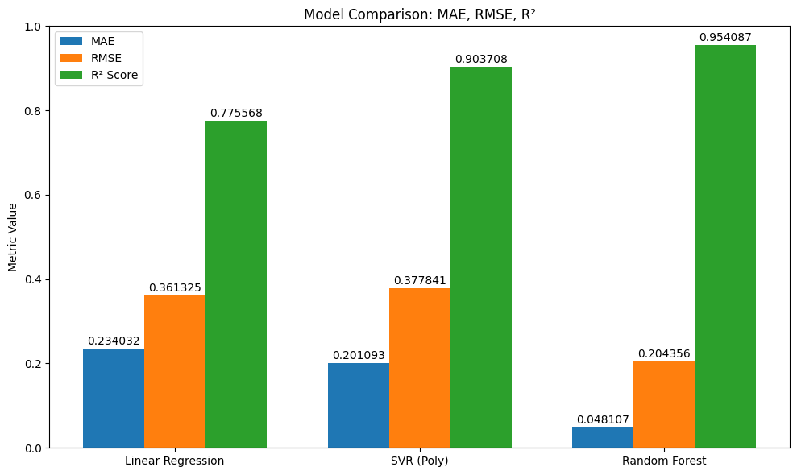

# 🏃‍♂️ Distance Walked Prediction (Health Data)

This project uses Machine Learning models to predict the **daily distance walked (in kilometers)** based on health and lifestyle features such as step count, sleep duration, physical activity, and more.

The dataset was sourced from Kaggle and **manually edited** to suit the prediction objective.

---

## 🔍 Models Implemented
1. **Linear Regression**
2. **Support Vector Regression (SVR)**
3. **Random Forest Regressor**

The models are compared using:
- R² Score
- Mean Absolute Error (MAE)
- Root Mean Squared Error (RMSE)

---

## 📊 Visuals Included
- **Histogram**: Distribution of Distance Walked (km)
- **Correlation Matrix**: Heatmap of numeric feature relationships
- **Pairplot**: Pairwise relationships between core health metrics
- **Scatter Plots**: Actual vs Predicted Distance Walked (for all 3 models)
- **Bar Plot Comparison**: Model performance comparison (R², MAE, RMSE)

---

## 🛠 Tech Stack
- Python
- pandas, numpy
- scikit-learn
- matplotlib, seaborn
- Jupyter Notebook

---

## 📂 File Structure
```
Distance_Walked/
├── Distance.ipynb                   🔹 Main notebook with ML Workflow
├── Distance.py                      🔹 Python code of same ML Workflow
├── Health_dataset.csv               🔹 Cleaned and customized dataset (from: kaggle)
├── LICENSE                          🔹 MIT License
└── README.md                        🔹 This file !!
```

---

### 🔽 Model Performance Comparison



---

## 🚀 Future Scope
This project may soon be integrated into a **web app or website**, where users can:
- Enter their health stats
- Get distance walked predictions
- Visualize trends over time

---

## 👤 Author
Anuj Kulkarni - aka - steam-bell-92


